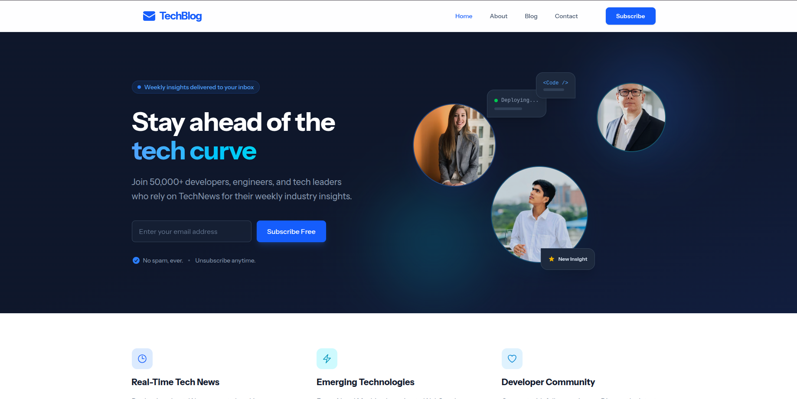
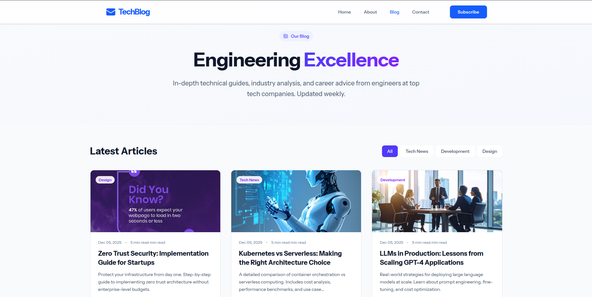
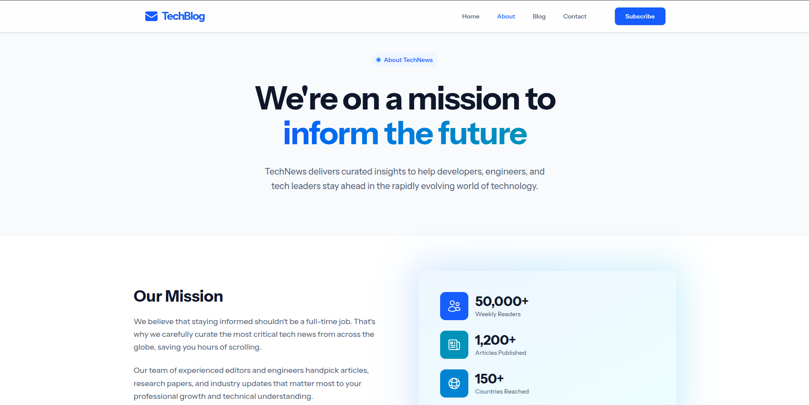
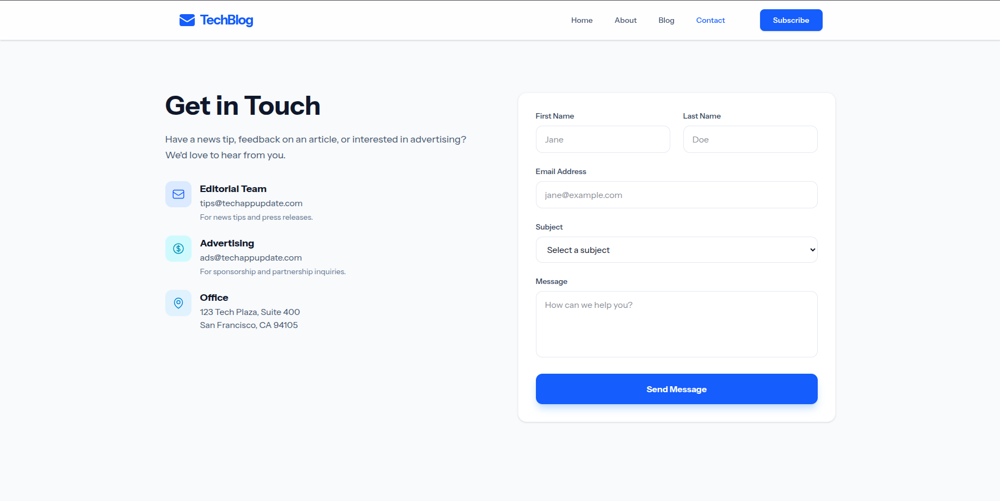
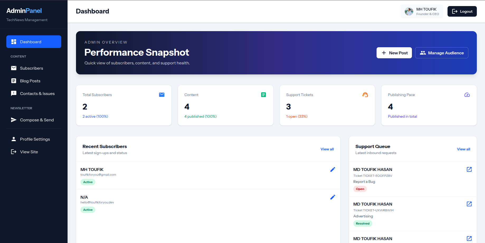
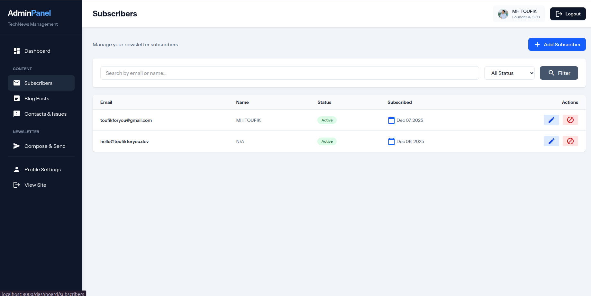
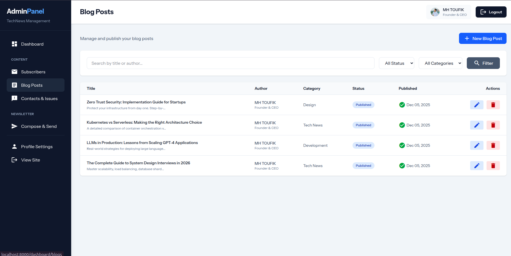
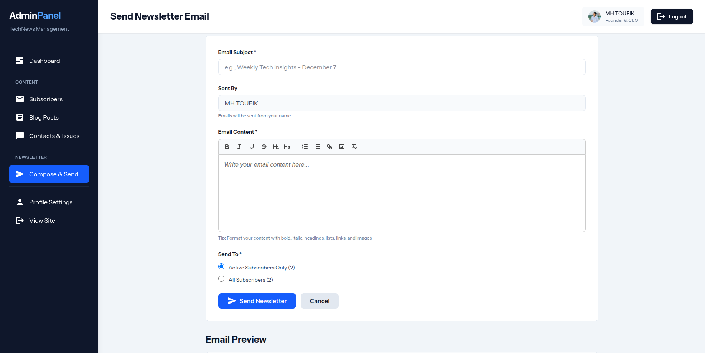
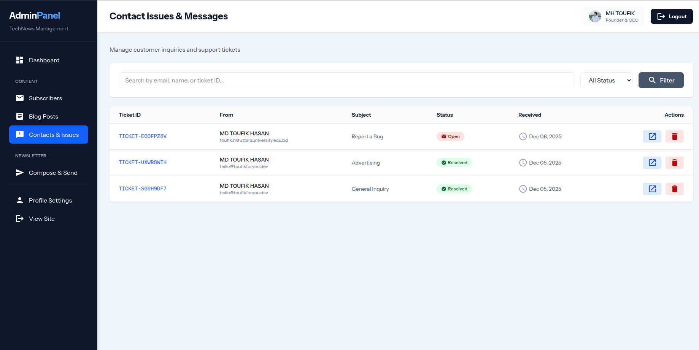

# 📰 TechNews Newsletter Platform

> A comprehensive newsletter and blog management system with powerful admin controls, email queue system, and modern responsive design.


---

## 🌟 Overview

TechNews is a full-featured newsletter platform built with Laravel 11 and Tailwind CSS. It combines a beautiful public-facing website with a powerful admin dashboard for managing subscribers, publishing blog posts, handling contact requests, and sending newsletters through an asynchronous queue system.

Perfect for tech blogs, news sites, content creators, and businesses looking to build and engage their subscriber base.

---

## 📸 Screenshots

### 🌐 Public Website

<div align="center">

| Home Page                                                | Blog Listing                                        |
| -------------------------------------------------------- | --------------------------------------------------- |
|  |  |
| Modern landing with hero section                         | Paginated posts with categories                     |

| About Page                                         | Contact Form                                           |
| -------------------------------------------------- | ------------------------------------------------------ |
|  |  |
| Team and mission showcase                          | Support ticketing system                               |

| Subscribe Page                                                     |
| ------------------------------------------------------------------ |
|  |
| Newsletter signup with confirmation                                |

</div>

### 🎛️ Admin Dashboard

<div align="center">

| Dashboard Overview                                      | Subscriber Management                                               |
| ------------------------------------------------------- | ------------------------------------------------------------------- |
|  |  |
| KPIs and analytics at a glance                          | List, filter, and manage subscribers                                |

| Blog Management                                          | Newsletter Composer                                                       |
| -------------------------------------------------------- | ------------------------------------------------------------------------- |
|  |  |
| Create and publish posts                                 | Send emails to subscribers                                                |

| Contact/Support Tickets                                         |
| --------------------------------------------------------------- |
|  |
| Manage and reply to inquiries                                   |

</div>

---

## ✨ Features

### 🌐 Public Website

- **🏠 Landing Page** - Beautiful hero section with testimonials and call-to-action
- **📝 Dynamic Blog** - SEO-friendly blog posts with categories, tags, and related content
- **📧 Newsletter Signup** - Email subscription with confirmation system
- **📞 Contact Form** - Integrated support ticketing with email notifications
- **📱 Responsive Design** - Mobile-first, works flawlessly on all devices
- **⚡ Fast Performance** - Optimized assets with Vite bundling

### 🎛️ Admin Dashboard

- **📊 Analytics Dashboard** - Real-time KPIs for subscribers, blogs, and support tickets
- **✍️ Blog Management** - WYSIWYG editor for creating and publishing posts
- **👥 Subscriber Management** -
    - Track subscriber status (Active, Unsubscribed, Bounced)
    - Filter and search subscribers
    - Delete unsubscribed emails with one click
    - Export subscriber lists
- **📬 Newsletter System** -
    - Rich email composer with preview
    - Queue-based asynchronous sending
    - Send to active subscribers or all
    - Track delivery status
- **🎫 Support Ticketing** -
    - Manage contact form submissions
    - Reply directly from dashboard
    - Update ticket status
    - Email notifications
- **👤 Admin Profile** - Update personal info and password
- **🔐 Secure Authentication** -
    - Domain-based admin registration
    - OTP email verification
    - Queue-based email delivery

### 🔧 Technical Features

- **⚙️ Queue System** - Background processing for emails and heavy tasks
- **🗄️ Database Optimization** - Indexed queries and efficient schema
- **🔒 Security** - CSRF protection, SQL injection prevention, XSS filtering
- **📧 Email Queue** - Asynchronous email delivery for better performance
- **🎨 Modern UI** - Material Icons and Tailwind CSS components
- **🧪 Testing Ready** - Pest PHP testing framework included

## 🚀 Quick Start

### 📋 Requirements

- **PHP** 8.4 or higher
- **Node.js** 18+ and npm
- **MySQL** 8.0+ (via XAMPP/Lampp or native installation)
- **Composer** 2.x
- **Git** (for cloning)

### ⚡ Installation (Step by Step)

**Step 1: Clone & Navigate**

```bash
git clone https://github.com/toufikforyou/newsletter-project.git
cd newsletter-project
```

**Step 2: Install Dependencies**

```bash
composer install
npm install
```

**Step 3: Setup Environment**

```bash
cp .env.example .env
php artisan key:generate
```

**Step 4: Configure Database (Local)**

For **Lampp (XAMPP)** - recommended for local development:

```bash
# Start Lampp MySQL
sudo /opt/lampp/lampp startmysql

# Create database using Lampp MySQL
/opt/lampp/bin/mysql -u root -e "CREATE DATABASE IF NOT EXISTS newsletter_project CHARACTER SET utf8mb4 COLLATE utf8mb4_unicode_ci;"

# Update .env file
APP_ENV=local
APP_DEBUG=true
APP_URL=http://localhost:8000
DB_CONNECTION=mysql
DB_HOST=127.0.0.1
DB_PORT=3306
DB_DATABASE=newsletter_project
DB_USERNAME=root
DB_PASSWORD=
```

For **native MySQL**:

```bash
mysql -u root -p
CREATE DATABASE newsletter_project CHARACTER SET utf8mb4 COLLATE utf8mb4_unicode_ci;
EXIT;

# Update .env accordingly with your MySQL credentials
```

**Step 5: Run Migrations**

```bash
php artisan migrate
```

**Step 6: Create Storage Symlink**

```bash
php artisan storage:link
```

**Step 7: Start Development Server**

All-in-one command (recommended):

```bash
composer run dev
```

This starts:

- ✅ Laravel server on `http://127.0.0.1:8000`
- ✅ Vite asset bundler on `http://localhost:5173`
- ✅ Queue worker for background jobs
- ✅ Application logs (Pail)

Or manually in separate terminals:

```bash
# Terminal 1 - Vite asset bundler
npm run dev

# Terminal 2 - Laravel server
php artisan serve

# Terminal 3 - Queue worker (for emails)
php artisan queue:work
```

**🎉 Visit: http://localhost:8000**

### 🔑 Admin Access

To create an admin account:

1. Visit `http://localhost:8000/admin/register`
2. Enter an email from authorized domain (default: `techappupdate.com`)
3. Check your email for OTP (if queue is running)
4. Complete registration with name and password
5. Login at `http://localhost:8000/admin/login`

**Configure allowed domains** in `.env`:

```env
ADMIN_ALLOWED_DOMAINS=techappupdate.com,yourdomain.com
```

---

## 🗺️ Routes

| Route                           | Description                                     |
| ------------------------------- | ----------------------------------------------- |
| `/`                             | Home page with hero, features, and latest blogs |
| `/about`                        | About page with team information                |
| `/blog`                         | Blog listing (paginated)                        |
| `/blog/{slug}`                  | Individual blog post detail page                |
| `/contact`                      | Contact form & support tickets                  |
| `/subscribe`                    | Newsletter subscription page                    |
| `/admin/register`               | Admin registration with OTP                     |
| `/admin/login`                  | Admin login                                     |
| `/dashboard`                    | Admin dashboard (protected)                     |
| `/dashboard/subscribers`        | Subscriber management                           |
| `/dashboard/blogs`              | Blog post management                            |
| `/dashboard/contacts`           | Support ticket management                       |
| `/dashboard/newsletter/compose` | Newsletter composer                             |

---

## 🛠️ Tech Stack

| Technology         | Purpose                                     |
| ------------------ | ------------------------------------------- |
| **Laravel 11**     | Backend framework with routing, ORM, queues |
| **Blade**          | Server-side templating engine               |
| **Tailwind CSS**   | Utility-first CSS framework                 |
| **Vite**           | Fast frontend build tool & asset bundler    |
| **MySQL**          | Relational database                         |
| **Material Icons** | Icon library for UI                         |
| **Pest PHP**       | Modern testing framework                    |
| **Queue System**   | Asynchronous job processing                 |

---

## 💻 Development

### 🏃 Local Development (Fast Setup)

```bash
# Single command to start everything:
# - Laravel server on http://127.0.0.1:8000
# - Vite on http://localhost:5173
# - Queue listener for background jobs
# - Application logs (pail)
composer run dev
```

Press `Ctrl+C` to stop all processes.

### 🔧 Individual Commands

```bash
# Watch & compile assets (terminal 1)
npm run dev

# Laravel development server (terminal 2)
php artisan serve

# Queue listener for emails & jobs (terminal 3)
php artisan queue:listen

# Tail application logs (terminal 4)
php artisan pail
```

### 🧪 Testing

```bash
# Run all tests
php artisan test

# Run specific test file
php artisan test --filter=ExampleTest
```

### 🧹 Other Useful Commands

```bash
# Clear all caches
php artisan optimize:clear

# Generate cache tables (if using database driver)
php artisan cache:table
php artisan queue:table
php artisan migrate

# Create storage symlink
php artisan storage:link
```

---

## 🚀 Deployment (Production)

### 📝 Pre-Deployment Setup

**Step 1: Environment Configuration**

```bash
# Create .env for production
cp .env.example .env

# Set production values
APP_ENV=production
APP_DEBUG=false
APP_URL=https://yourdomain.com

# Admin allowed domains (comma-separated)
ADMIN_ALLOWED_DOMAINS=yourdomain.com,anotherdomain.com

# Database (use your production database)
DB_CONNECTION=mysql
DB_HOST=your-db-host
DB_PORT=3306
DB_DATABASE=newsletter_project
DB_USERNAME=db_user
DB_PASSWORD=secure_password

# Mail configuration (update with your SMTP details)
MAIL_MAILER=smtp
MAIL_HOST=your-smtp-host
MAIL_PORT=587
MAIL_USERNAME=your-email
MAIL_PASSWORD=your-password
MAIL_ENCRYPTION=tls
MAIL_FROM_ADDRESS=noreply@yourdomain.com
MAIL_FROM_NAME="TechNews"

# Cache and Queue (for production stability)
CACHE_STORE=database
QUEUE_CONNECTION=database
```

**Step 2: Generate Application Key**

```bash
php artisan key:generate
```

**Step 3: Install & Optimize Dependencies**

```bash
composer install --no-dev --optimize-autoloader
npm install --production
```

**Step 4: Build Frontend Assets**

```bash
npm run build
```

**Step 5: Run Migrations**

```bash
php artisan migrate --force
```

**Step 6: Create Storage Symlink**

```bash
php artisan storage:link
```

**Step 7: Cache Configuration & Routes (Performance)**

```bash
php artisan config:cache
php artisan route:cache
php artisan view:cache
```

**Step 8: Set Permissions**

```bash
# For Linux/Unix servers
sudo chown -R www-data:www-data storage bootstrap/cache
chmod -R 755 storage bootstrap/cache
```

### 🌐 Web Server Configuration

**Nginx**

```nginx
server {
    listen 80;
    server_name yourdomain.com;
    root /path/to/newsletter-project/public;

    index index.php;

    location / {
        try_files $uri $uri/ /index.php?$query_string;
    }

    location ~ \.php$ {
        fastcgi_pass unix:/run/php/php8.4-fpm.sock;
        fastcgi_param SCRIPT_FILENAME $realpath_root$fastcgi_script_name;
        include fastcgi_params;
    }

    location ~ /\.(?!well-known).* {
        deny all;
    }
}
```

**Apache** (with `.htaccess` in `public/`)

- Point document root to `public/`
- Enable `mod_rewrite`
- Verify `.htaccess` exists in `public/` directory

### 🔄 Running Queue Workers (Background Jobs)

**Critical:** The queue worker must run continuously for:

- Sending newsletter emails
- OTP verification emails for admin registration
- Contact form notifications
- Any background processing

**Option 1: Manual Worker (Testing)**

```bash
php artisan queue:work --timeout=60
```

**Option 2: Supervisor (Production - Recommended)**

Create `/etc/supervisor/conf.d/newsletter-queue.conf`:

```ini
[program:newsletter-queue]
process_name=%(program_name)s_%(process_num)02d
command=php /path/to/newsletter-project/artisan queue:work --timeout=60 --tries=3
autostart=true
autorestart=true
user=www-data
numprocs=2
redirect_stderr=true
stdout_logfile=/var/log/newsletter-queue.log
```

Then run:

```bash
sudo supervisorctl reread
sudo supervisorctl update
sudo supervisorctl start newsletter-queue:*
```

---

### 🔍 Monitoring & Maintenance

```bash
# Check for failed jobs
php artisan queue:failed

# Retry failed jobs
php artisan queue:retry all

# Clear old jobs (cleanup)
php artisan queue:flush

# Monitor queue in real-time
php artisan queue:monitor

# Database cleanup for old jobs
php artisan queue:prune-failed --hours=48
```

---

## 📁 Project Structure

```
newsletter-project/
├── app/
│   ├── Http/
│   │   └── Controllers/
│   │       ├── Admin/              # Admin dashboard controllers
│   │       │   ├── AdminController.php
│   │       │   ├── BlogController.php
│   │       │   ├── ContactController.php
│   │       │   ├── SubscriberController.php
│   │       │   └── ProfileController.php
│   │       ├── Auth/
│   │       │   └── AdminAuthController.php  # Admin auth & OTP
│   │       ├── BlogPageController.php
│   │       ├── ContactController.php
│   │       └── SubscribeController.php
│   ├── Mail/                      # Email templates
│   │   ├── AdminOtpMail.php       # Admin OTP verification (queued)
│   │   ├── ContactReply.php
│   │   ├── ContactSuccess.php
│   │   ├── NewsletterEmail.php    # Newsletter composer
│   │   └── SubscriptionConfirmation.php
│   └── Models/
│       ├── Admin.php              # Admin user model
│       ├── Blog.php               # Blog post model
│       ├── Contact.php            # Support ticket model
│       └── Subscriber.php         # Newsletter subscriber
├── database/
│   └── migrations/                # Database schema
├── resources/
│   ├── views/
│   │   ├── admin/                 # Admin dashboard views
│   │   │   ├── dashboard.blade.php
│   │   │   ├── subscribers/
│   │   │   ├── blogs/
│   │   │   ├── contacts/
│   │   │   └── newsletter/
│   │   ├── auth/                  # Admin authentication
│   │   ├── emails/                # Email templates
│   │   ├── layouts/               # Layout templates
│   │   ├── partials/              # Reusable components
│   │   ├── home.blade.php
│   │   ├── blog.blade.php
│   │   └── subscribe.blade.php
│   ├── css/
│   │   └── app.css               # Tailwind imports
│   └── js/
│       └── app.js
├── routes/
│   └── web.php                   # All application routes
├── docs/
│   └── screenshorts/             # Project screenshots
├── .env.example                  # Environment template
├── composer.json                 # PHP dependencies
├── package.json                  # Node dependencies
├── vite.config.js               # Vite bundler config
└── README.md                     # This file
```

---

## 🤝 Contributing

Contributions are welcome! Please follow these steps:

1. Fork the repository
2. Create a feature branch (`git checkout -b feature/AmazingFeature`)
3. Commit your changes (`git commit -m 'Add some AmazingFeature'`)
4. Push to the branch (`git push origin feature/AmazingFeature`)
5. Open a Pull Request

---

## 📄 License

This project is open-sourced software licensed under the [MIT license](LICENSE).

---

## 👨‍💻 Author

**Toufik**

- GitHub: [@toufikforyou](https://github.com/toufikforyou)
- Repository: [newsletter-project](https://github.com/toufikforyou/newsletter-project)

---

## 🙏 Acknowledgments

- Laravel Framework
- Tailwind CSS
- Material Icons
- The open-source community

---
